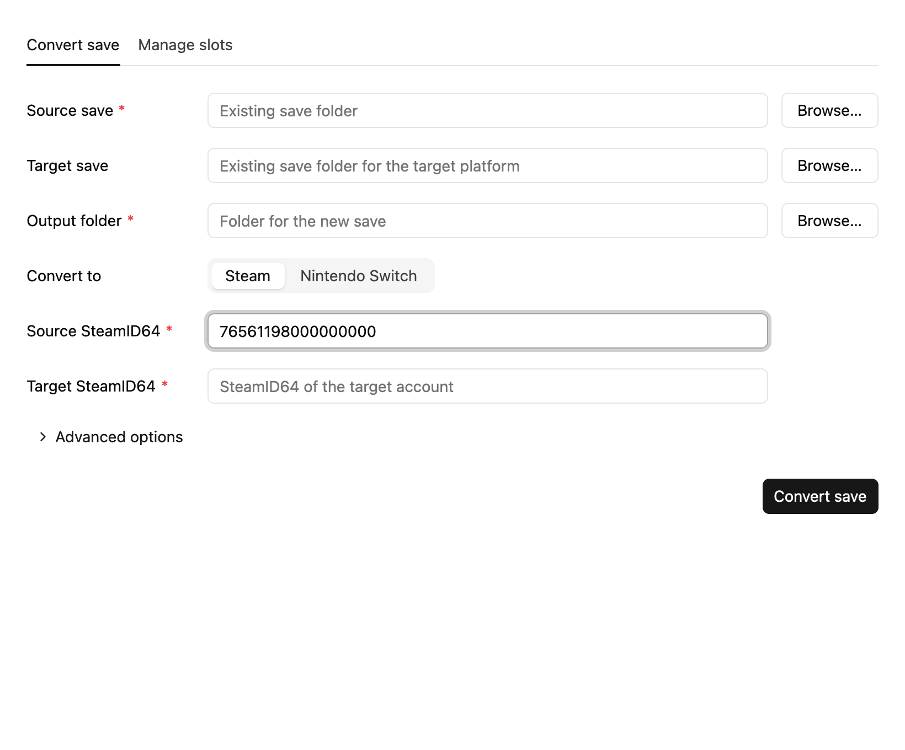
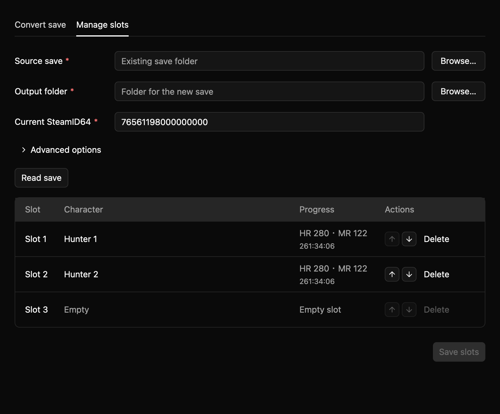

# MHRise Save Converter

Convert *Monster Hunter Rise* saves between Nintendo Switch and Steam, transfer Steam saves between accounts, and reorder or delete character slots.

<table>
  <tr>
    <td width="50%"></td>
    <td width="50%"></td>
  </tr>
</table>

## Download

Get the latest package from [Releases](https://github.com/jinghaihan/mhrise-save-converter/releases) and open `mhrise-save-converter-gui`.

Supported platforms: Windows 10+, macOS 15+ (Apple Silicon and Intel), and Linux with a Vulkan-capable graphics driver.

> [!WARNING]
> Back up your saves and disable Steam Cloud while testing. Switch → Steam has been verified in-game; Steam → Steam has not been fully verified in-game. Steam → Switch and slot deletion still need in-game verification.

## Convert saves

1. Open **Convert save** and choose the source save folder.
2. Choose the destination platform and its existing save folder under **Target save**. This is a reference save, not the output folder.
3. Enter the SteamID64 fields shown for Steam accounts. SteamID64 is the account's 17-digit numeric ID, not its display name.
4. Choose an **Output folder**, then click **Convert save**.

A target save is required for Steam → Switch and recommended when converting to Steam. If you omit a Steam target save, set the destination Curve Index under **Advanced**.

Source and target saves remain unchanged. Existing output files require confirmation before replacement; unrelated files are kept.

## Character-slot management

1. Open **Manage slots**, choose the complete source save folder, and enter its SteamID64 if it is a Steam save.
2. Click **Read save** to display all three slots.
3. Use **↑ / ↓** to move a character, including into an empty slot. Use **Delete** to mark a slot empty; other characters do not shift.
4. Choose a new output folder that does not already exist, then click **Save slots**.

The original save remains unchanged. Click **Read save** again to discard unsaved changes.

## More help

- [CLI commands, Steam IDs, and save locations](docs/cli.md)
- [Supported save files](docs/save-structure.md)

## Credits and license

Format research: [kvasszn/ree-save-editor](https://github.com/kvasszn/ree-save-editor).

[MIT](LICENSE) © [jinghaihan](https://github.com/jinghaihan)
